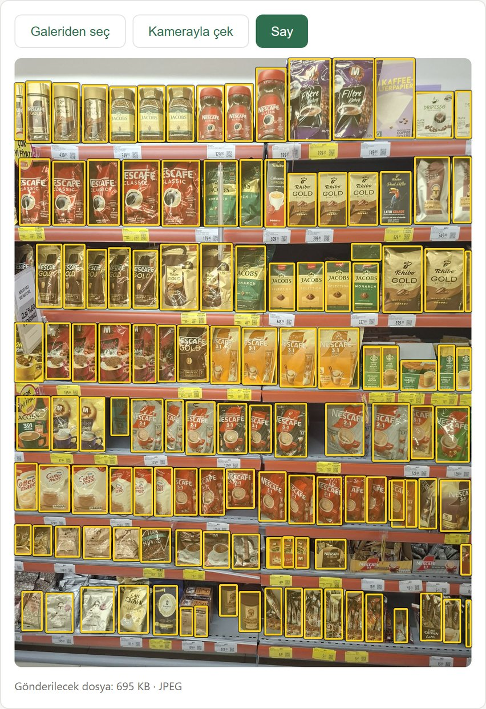
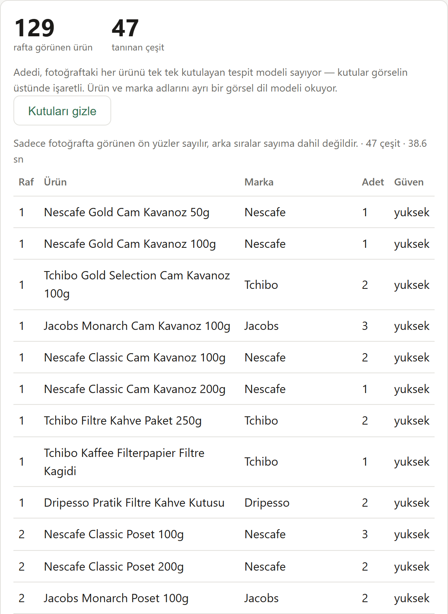

# Item Counter

A web app that counts products on a store shelf from a single photo and
names them.

Take a photo of a shelf with your phone (or pick one from the gallery). The
app marks every visible product with a box, gives the total count, and lists
the products by brand and name.

**Try it:** https://item-counter-jade.vercel.app

The interface is in Turkish. The live demo allows 3 tries per person per day,
because every try uses the project's Gemini quota.

<p>
  
  
</p>

## How it works

Counting and recognition are done by two separate models, running in
parallel:

- **YOLO11 does the counting, in your browser.** A detection model trained on
  the [SKU-110K](https://github.com/eg4000/SKU110K_CVPR19) dataset draws a box
  around each product. It runs on the visitor's device with
  [ONNX Runtime Web](https://onnxruntime.ai/docs/tutorials/web/), so no server
  is needed for it. It returns the same count for the same photo every time,
  in one or two seconds.
- **Gemini does the recognition, on the server.** A vision language model
  reads the brand, product name and size from the packaging, shelf by shelf.
  This takes 30 to 50 seconds.

A language model alone is not reliable for counting on a crowded shelf: the
same photo gave 124, 115 and 127 across three runs. A detection model is
consistent, but it doesn't know what a product is. Using both gives a stable
count and readable names.

The count and boxes appear as soon as the detection model finishes; the
product names follow when Gemini is done. If Gemini fails or is too slow, the
count and boxes are still shown.

```
browser ──> YOLO11 (ONNX, runs locally)        count, boxes
   │
   └──────> Next.js API (Vercel) ──> Gemini    names, brands
```

## Project structure

```
app/
  page.tsx            upload, photo preview with boxes, result tables
  api/say/route.ts    POST /api/say: product recognition with Gemini
lib/
  yolo.ts             detection model in the browser (preprocessing, NMS)
  gemini.ts           prompt, model fallback chain, timeouts
  sinir.ts            daily tries per visitor
yolo-servis/          the same detector as a Python service, plus the
                      scripts used to compare models and settings
```

## Running locally

Requirements: Node.js 20.9+ and a
[Gemini API key](https://aistudio.google.com/apikey).

```bash
cp .env.example .env.local   # then set GEMINI_API_KEY
npm install
npm run dev
```

Open http://localhost:3000. The daily try limit is off when running locally.

On first use the browser downloads the detection model (38 MB) from Hugging
Face and keeps it in its cache.

## Configuration

| Variable | Default | Description |
|---|---|---|
| `GEMINI_API_KEY` | | Required. |
| `GEMINI_MODEL` | see `lib/gemini.ts` | Comma-separated list of models, tried in order. The next one is used when a model hits its quota (429) or is overloaded (503). |
| `GEMINI_THINKING` | `HIGH` | `LOW`, `MEDIUM` or `HIGH`. Lower is faster but mixes up similar brands. |
| `GEMINI_COZUNURLUK` | `ULTRA_HIGH` | Image resolution sent to Gemini: `MEDIUM`, `HIGH` or `ULTRA_HIGH`. |
| `GEMINI_ZAMAN_ASIMI_MS` | `54000` | Time limit for the whole Gemini call, including fallbacks. Keep it under Vercel's 60-second limit. |
| `GUNLUK_DENEME_SINIRI` | `3` | Tries per visitor per day on the live site. `0` turns the limit off. |

The detection settings (input size 640, confidence 0.25, overlap 0.5, up to
1000 boxes) are at the top of `lib/yolo.ts`.

## Deployment

Deploy to Vercel and set `GEMINI_API_KEY`. Nothing else needs to run: the
detection model is downloaded and run by each visitor's browser.

## Limitations

- Only products visible from the front are counted. Items behind the front
  row are not in the photo.
- Product names take 30 to 50 seconds. Vercel stops requests at 60 seconds;
  the app gives Gemini 54 seconds and shows only the count and boxes if it
  runs out.
- On Gemini's free tier each model has a small daily request quota. When it
  runs out, or when Google reports a model as overloaded, requests fall
  through to the next model in the list, which can be slower or less
  accurate.
- The daily try limit is kept in server memory, so it resets when Vercel
  starts a new server instance. It is a rough guard, not a strict limit.
- The browser model takes a fixed 640x640 input, so portrait photos are
  padded at the sides. The Python service in `yolo-servis/` feeds the same
  model without padding; the two counts differ by 2-5% in either direction
  on our test photos.

## Model and license

The detection model is
[chistopat/sku110k-yolo11-object-detector](https://huggingface.co/chistopat/sku110k-yolo11-object-detector)
(YOLO11s, 640). Its weights are derived from the SKU-110K dataset and follow
that dataset's terms, so they are not included in this repository; the
browser downloads them from Hugging Face.
